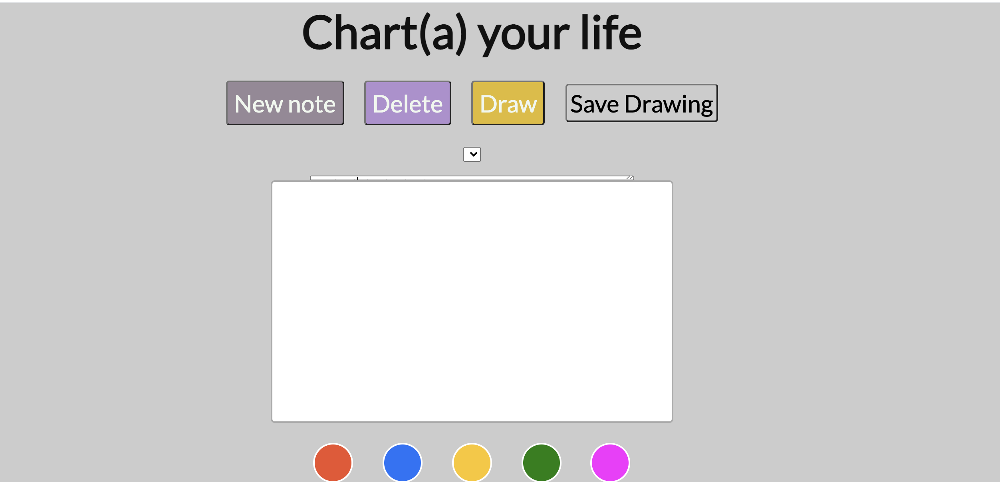

# Charta.js - jot down your thoughts anytime, anywhere.


This library can help you include various text editor functions into your web application. This module is a NodeJS module and is hosted through [npm registry](https://www.npmjs.com/).

## Installation Instructions 
1) If you haven't already, install [Node.js](https://nodejs.org/en/) first. This automatically will get `npm` (aka package manager for NodeJS) on your computer. 
2) Create a `package.json` file by running `npm init` in the Terminal.  
2) Then run ` npm i charta`.
3) Voila! Charta.js package is installed. See the instructions below on how to use it. 

## How to use? 
* Add the code below at the top of your JS file where you'd like to use this package. 
```
const myFunctions = require("index.js")

const newNote = myFunctions.newNote;
const deleteNote = myFunctions.deleteNote;
const changeNote = myFunctions.changeNote;
const saveNote = myFunctions.saveNote;
const checkEmpty = myFunctions.checkEmpty;
```
* Now the above functions `newNote`, `deleteNote`, and others are ready for your usage! 


### Contribution: 

* [Ideas Document](IDEAS.md) 
* [Upcoming Tasks](TODO.md)

### Design Elements:

* [Color Scheme](https://coolors.co/ffffff-b18fcf-978897-e1bc29) 

### Current state of the application built off this library (in progress): 



